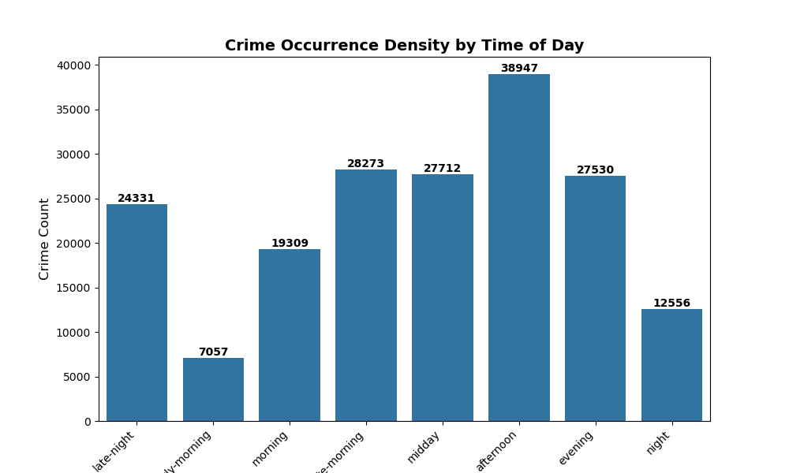
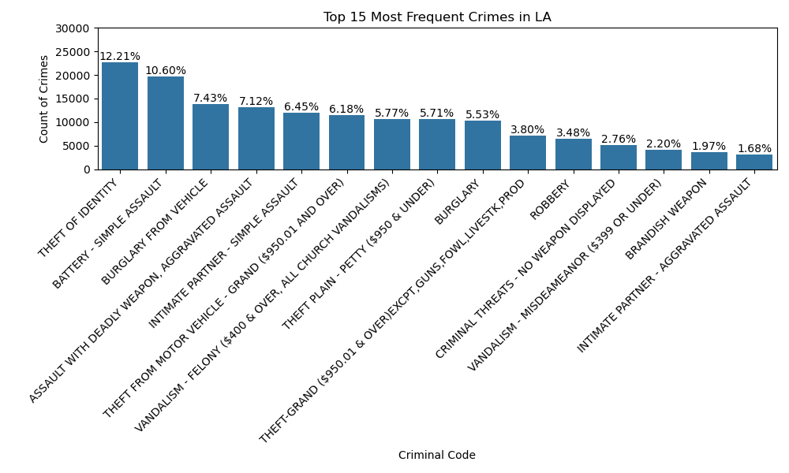
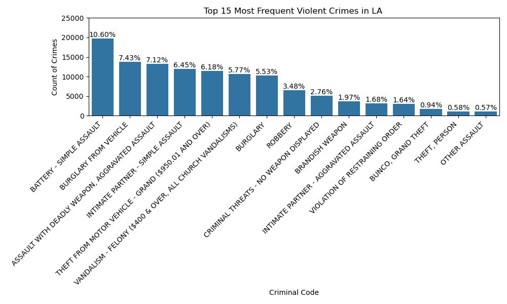
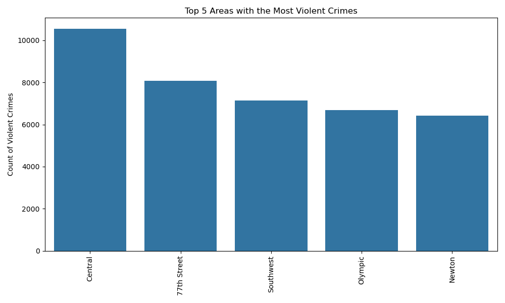
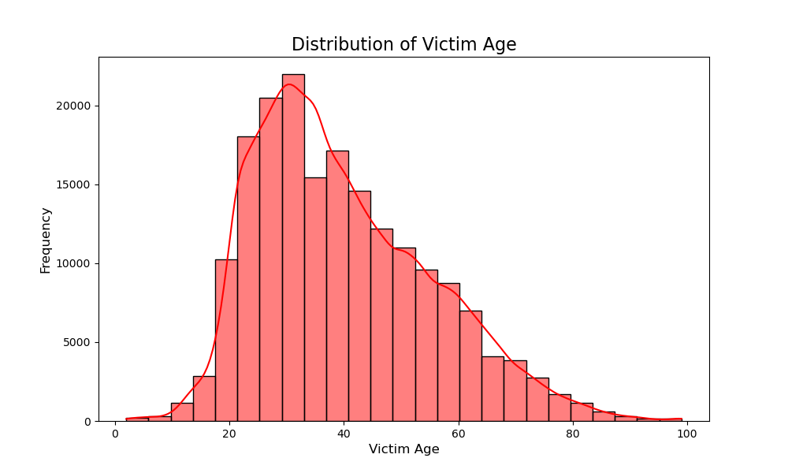
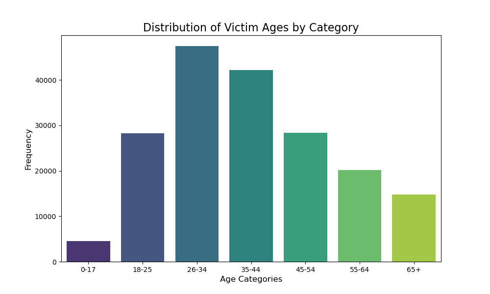
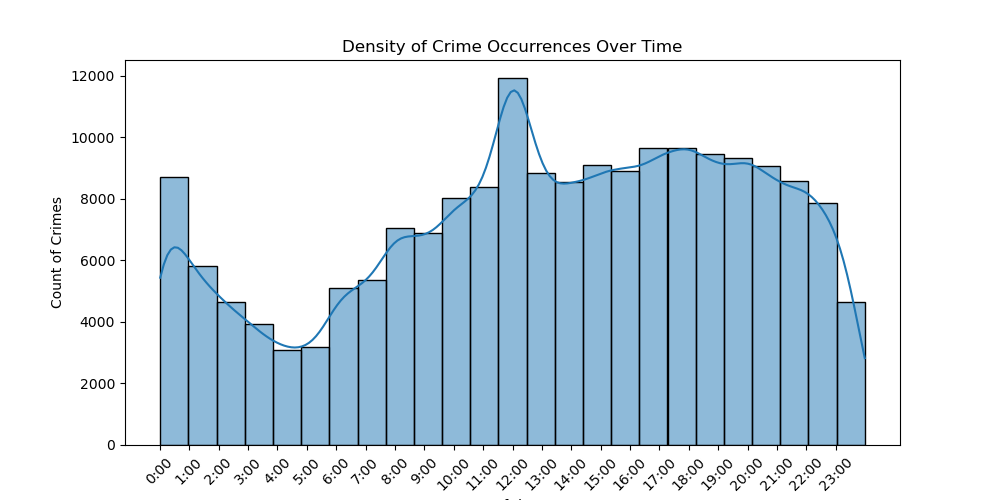

# Crime Statistics in Los Angeles

## Overview

This project presents an analysis of crime data from Los Angeles, focusing on crime patterns, the distribution of crime types, and the temporal and geographical variations of criminal activities. The insights derived from this analysis aim to assist the Los Angeles Police Department (LAPD) in making informed decisions to optimise resource allocation across districts.

## Key Findings

- **Crime Occurrence by Time of Day:**
  The analysis shows a clear pattern of increased criminal activity in the afternoon, followed by the evening and morning hours. The late-night period also experiences a significant number of crimes, but it is notably lower than the other time periods.
  
  

- **Top 15 Most Frequent Crimes in Los Angeles:**
  The most frequently occurring crime in Los Angeles is 'Theft of Identity,' followed closely by 'Battery - Simple Assault.' These two crime types make up over 20% of all crimes in the dataset.
  
  

- **Top 15 Most Frequent Violent Crimes in Los Angeles:**
  Among violent crimes, 'Battery - Simple Assault' is the most frequent, followed by 'Burglary from Vehicle' and 'Burglary.' These crimes represent a significant proportion of violent incidents in Los Angeles.
  
  

- **Top 5 Areas with the Most Violent Crimes:**
  The 'Central' district has the highest number of violent crimes, with over 10,000 incidents, followed by '77th Street' and 'Southwest.' These areas face the highest criminal activity in the city.
  
  

- **Distribution of Victim Age:**
  The age distribution of crime victims shows a higher frequency of crimes among younger individuals, particularly between the ages of 20 and 40. The frequency drops significantly for older age groups.
  
  

- **Distribution of Victim Ages by Category:**
  When categorising the victims' ages, the highest frequency is found among individuals aged 26-34, followed closely by the 35-44 age group. The youngest and oldest age categories exhibit fewer crime incidents.
  
  

- **Crime Density Over Time:**
  Crimes show a notable peak around midday (12:00) with a second smaller peak in the evening (around 7:00 PM). The least number of crimes occur in the early morning hours, especially between 3:00 and 4:00 AM.
  
  

## Conclusion

This analysis provides critical insights into crime patterns within Los Angeles, identifying when and where crimes are most likely to occur. Understanding these patterns allows the LAPD to allocate resources more effectively and plan interventions based on time and location. The findings also highlight the need for targeted efforts to address specific crime types and areas with higher crime rates.

## Further Analysis

To enhance the insights gained from this analysis, additional exploration can be conducted by incorporating the 'Vict Descent' column data. This would allow for a deeper understanding of crime patterns across different demographic groups, providing a more comprehensive view of crime in Los Angeles.

Additionally, creating an interactive dashboard could further improve the accessibility and usability of the analysis. By integrating the visualisations into a dynamic, user-friendly interface, stakeholders can explore the data more effectively, filter by different variables, and gain more actionable insights for decision-making.

